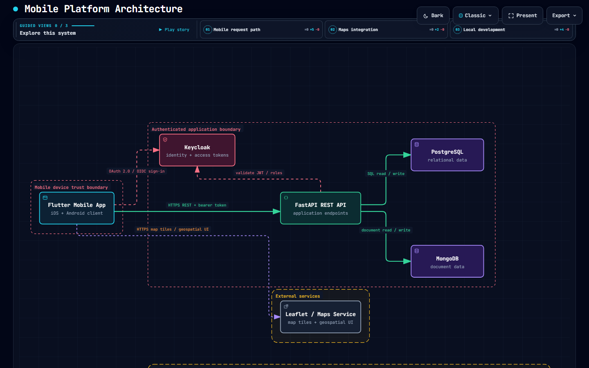
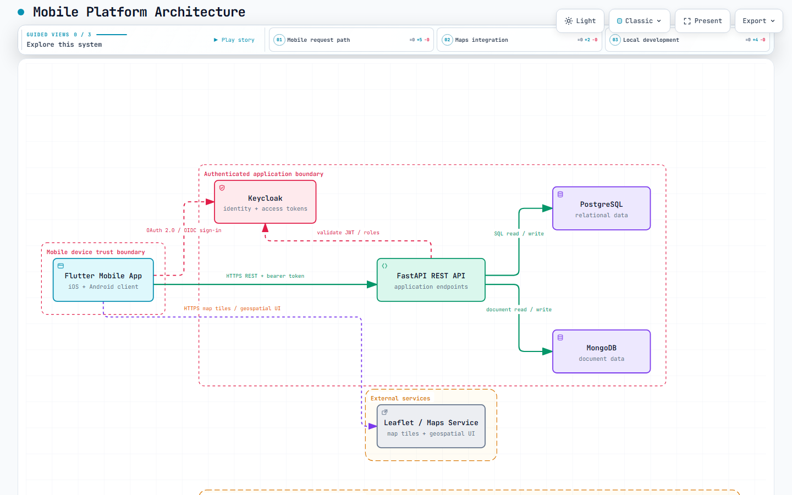
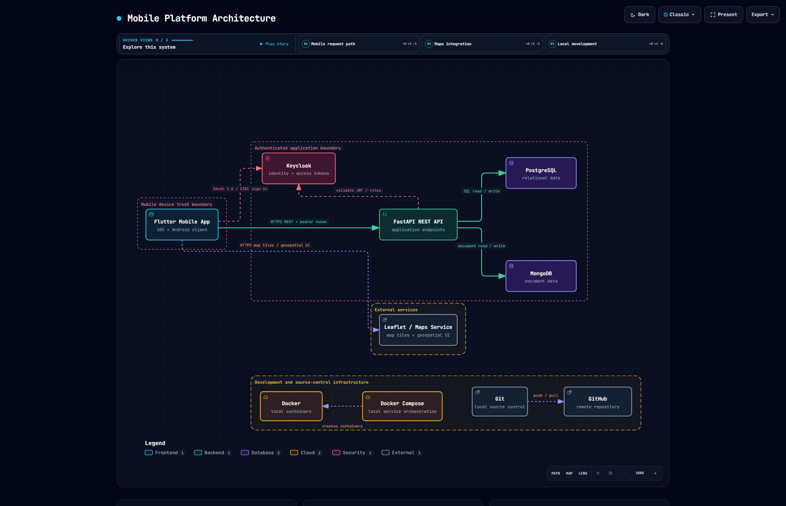
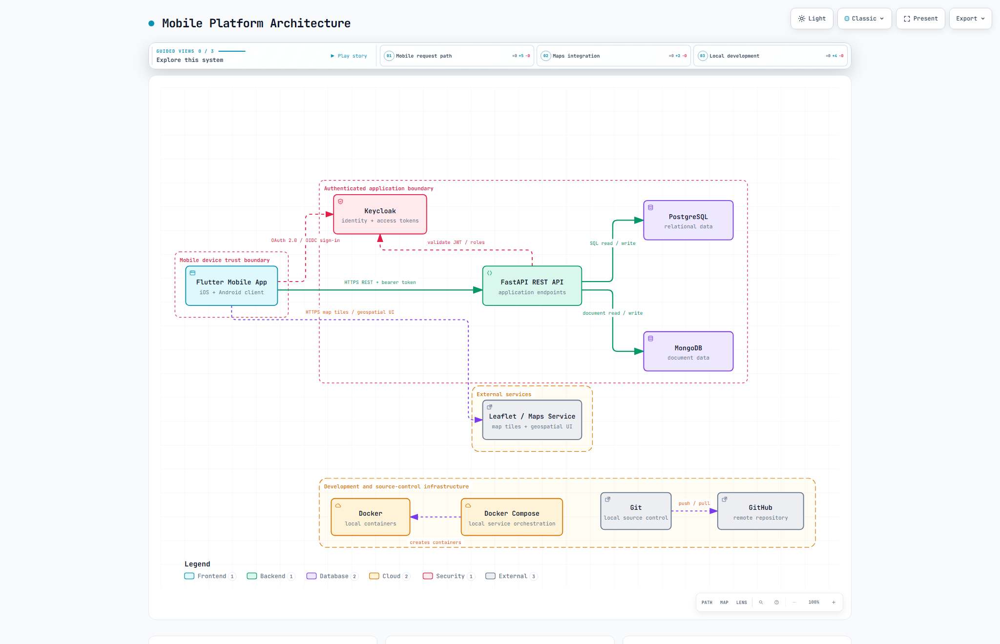

# Prácticas Integradora — Desarrollo de Software · UTXJ

> **Universidad Tecnológica de Xicotepec de Juárez (UTXJ)**  
> Carrera: Desarrollo de Software · Cuatrimestre: 230314

---

## 🔗 Diagrama interactivo en línea

▶️ **[Ver diagrama en GitHub Pages](https://giova0412.github.io/Practicas_integradora_230314/)**

El diagrama puede visualizarse en modo claro u oscuro, con navegación guiada por vistas y modo presentación integrado.

---

## 📋 Descripción

Este repositorio documenta las prácticas de la materia **Integradora** correspondientes al periodo **230314**. El proyecto principal consiste en el modelado y documentación de la **arquitectura de una plataforma móvil**, representando los componentes, fronteras de seguridad y flujos de comunicación del sistema.

---

## 🛠️ Herramientas utilizadas

| Herramienta | Propósito |
|---|---|
| **Archify Codex** | Generación y renderizado de los diagramas de arquitectura en formato interactivo (HTML autocontenido) |
| **Git / GitHub** | Control de versiones y publicación mediante GitHub Pages |
| **Docker / Docker Compose** | Orquestación de servicios locales durante el desarrollo |

> Los diagramas de arquitectura fueron creados y exportados con **Archify Codex**, herramienta que genera archivos HTML autocontenidos con el visor interactivo integrado, soporte de temas claro/oscuro, vistas guiadas y modo presentación.

---

## 🏗️ Arquitectura modelada

### Mobile Platform Architecture

El diagrama modela una plataforma móvil completa con los siguientes componentes:

| Componente | Tipo | Descripción |
|---|---|---|
| **Flutter Mobile App** | Frontend | Cliente iOS + Android |
| **Keycloak** | Seguridad | Identidad y tokens de acceso (OAuth 2.0 / OIDC) |
| **FastAPI REST API** | Backend | Endpoints de la aplicación |
| **PostgreSQL** | Base de datos | Datos relacionales |
| **MongoDB** | Base de datos | Datos de documentos |
| **Leaflet / Maps Service** | Externo | Tiles de mapas e interfaz geoespacial |
| **Docker + Docker Compose** | Infraestructura local | Contenedores y orquestación |
| **Git + GitHub** | Control de versiones | Repositorio local y remoto |

### Vistas guiadas del diagrama

1. **Mobile request path** — Flujo de tráfico autenticado desde el cliente móvil hasta los datos persistentes.
2. **Maps integration** — Integración del cliente móvil con el servicio externo de mapas.
3. **Local development** — Flujo de trabajo con Docker Compose, Git y GitHub.

---

## 📸 Capturas del diagrama

### Tema Oscuro — 1440 × 900



### Tema Claro — 1440 × 900



### Tema Oscuro — 2048 × 1320



### Tema Claro — 2048 × 1320



---

## 📁 Estructura del repositorio

```
Practicas_integradora_230314/
├── index.html                              # Diagrama interactivo principal (Archify Codex)
├── mobile-platform-architecture.html      # Copia del diagrama
├── mobile-platform-architecture.json      # Fuente de datos del diagrama (Archify Codex)
├── mobile-platform-architecture.visual-check.html   # Evidencia visual automatizada
├── mobile-platform-architecture.visual-check.json   # Metadatos de la verificación visual
├── images/
│   ├── mobile-platform-architecture.visual-check.1440x900.dark.png
│   ├── mobile-platform-architecture.visual-check.1440x900.light.png
│   ├── mobile-platform-architecture.visual-check.2048x1320.dark.png
│   └── mobile-platform-architecture.visual-check.2048x1320.light.png
└── README.MD
```

---

## 🔒 Fronteras de seguridad

El diagrama identifica dos fronteras de seguridad principales:

- **Mobile device trust boundary** — Las credenciales y tokens solo cruzan el límite del dispositivo móvil a través de OIDC.
- **Authenticated application boundary** — El acceso a la API está autenticado antes de llegar a los servicios de datos.

---

## 👤 Autor

**Giovanni** · UTXJ · Desarrollo de Software · 230314  
Repositorio: [https://github.com/giova0412/Practicas_integradora_230314](https://github.com/giova0412/Practicas_integradora_230314)
