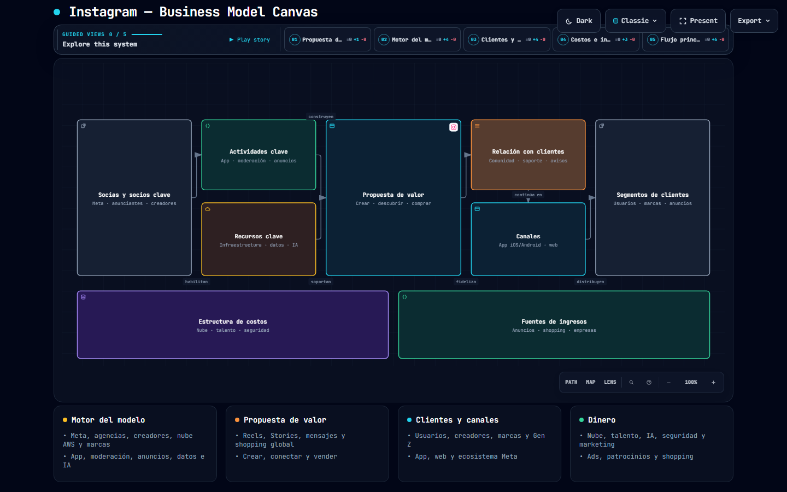
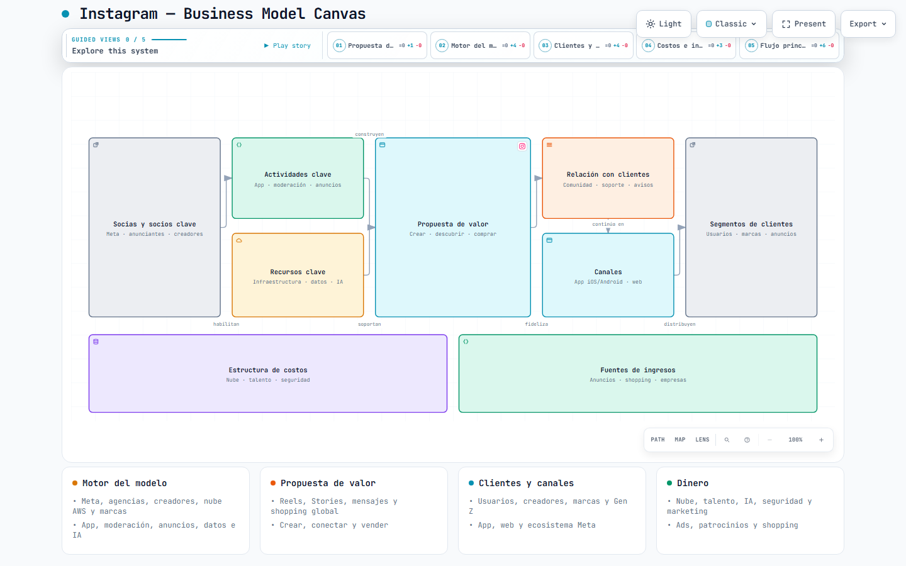
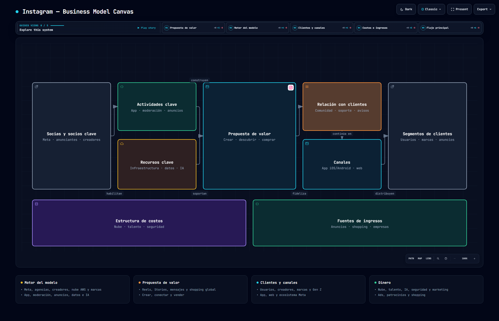
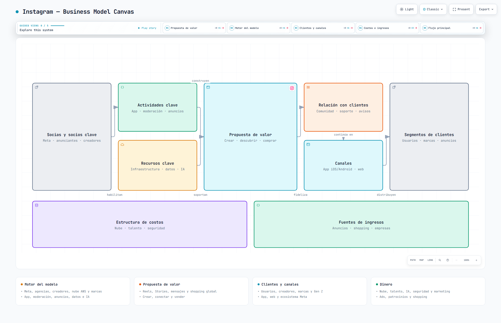

# Práctica 03: Instagram Business Model Canvas

Esta práctica consistió en la generación de un **Business Model Canvas** interactivo para Instagram. A diferencia de las prácticas anteriores, este diagrama fue creado utilizando **Open Code** en lugar de Codex.

## 🤖 Prompt utilizado

```text
Create an interactive HTML Business Model Canvas for INSTAGRAM.

Use the uploaded image as the visual reference.

DO NOT create a software architecture diagram.

Create a traditional 9-block Business Model Canvas with this layout:

KEY PARTNERS | KEY ACTIVITIES | VALUE PROPOSITIONS | CUSTOMER RELATIONSHIPS | CUSTOMER SEGMENTS

KEY ACTIVITIES has KEY RESOURCES below it.

CUSTOMER RELATIONSHIPS has CHANNELS below it.

Bottom:
COST STRUCTURE | REVENUE STREAMS

Use the following Instagram content:

KEY PARTNERS:
Meta Platforms, advertising agencies, influencers, content creators, technology providers, cloud providers, AWS, e-commerce platforms, analytics companies, telecommunications companies, smartphone manufacturers and brands.

KEY ACTIVITIES:
Platform development, app development, UX improvements, content moderation, community management, advertising management, data analytics, algorithm development, security, privacy and creator tools.

KEY RESOURCES:
Technology infrastructure, user data, analytics, cloud infrastructure, algorithms, mobile app, brand reputation, moderation systems, engineering teams, data science teams and intellectual property.

VALUE PROPOSITIONS:
Photo and video sharing, social networking, visual storytelling, Reels, Stories, content discovery, direct messaging, creator tools, influencer marketing, business promotion, personalized content, community building, shopping and global audience reach.

CUSTOMER RELATIONSHIPS:
Self-service, personalized recommendations, community interaction, feedback, customer support, creator support, business support, notifications, messaging and privacy controls.

CUSTOMER SEGMENTS:
General users, creators, influencers, photographers, businesses, brands, advertisers, entrepreneurs, online stores, artists, public figures, Millennials and Gen Z.

CHANNELS:
Instagram mobile app, Instagram web, App Store, Google Play, digital advertising, influencer partnerships, brand collaborations, email and Meta ecosystem.

COST STRUCTURE:
Cloud infrastructure, servers, data storage, employee salaries, software development, R&D, AI development, moderation, cybersecurity, marketing, customer support, legal compliance and technology services.

REVENUE STREAMS:
Advertising, Instagram Ads, Reels Ads, Stories Ads, sponsored content, branded content, shopping-related fees, business tools, creator monetization and promotional services.

DESIGN:
- White background
- Instagram title at top
- "BUSINESS MODEL CANVAS" subtitle
- Yellow/orange rounded cards
- Green Revenue Streams card
- Dark pill-shaped section headers
- White icons
- Modern professional infographic
- Rounded corners
- Same visual organization as the uploaded reference
- Responsive layout
- Clean typography
- Proper spacing

INTERACTIVITY:
- Hover effects
- Click each section to expand details
- Smooth animations
- Highlight selected section
- Responsive HTML
- No backend
- No database
- Standalone HTML5/CSS3/JavaScript

Make the final result look like a polished professional Instagram Business Model Canvas, not a software architecture diagram.
```

## 📸 Capturas del Business Model Canvas

### Tema Oscuro — 1440 × 900


### Tema Claro — 1440 × 900


### Tema Oscuro — 2048 × 1320


### Tema Claro — 2048 × 1320

